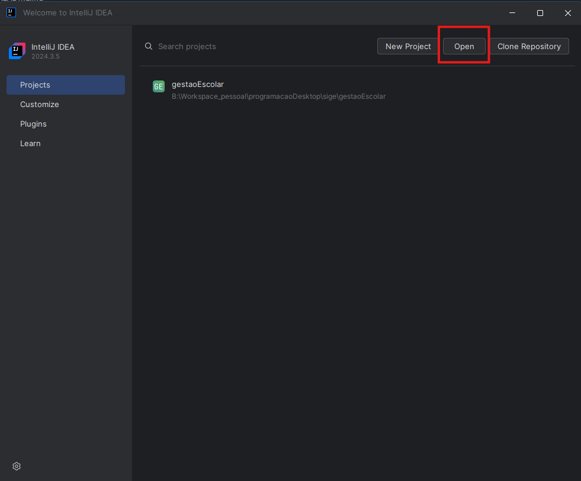
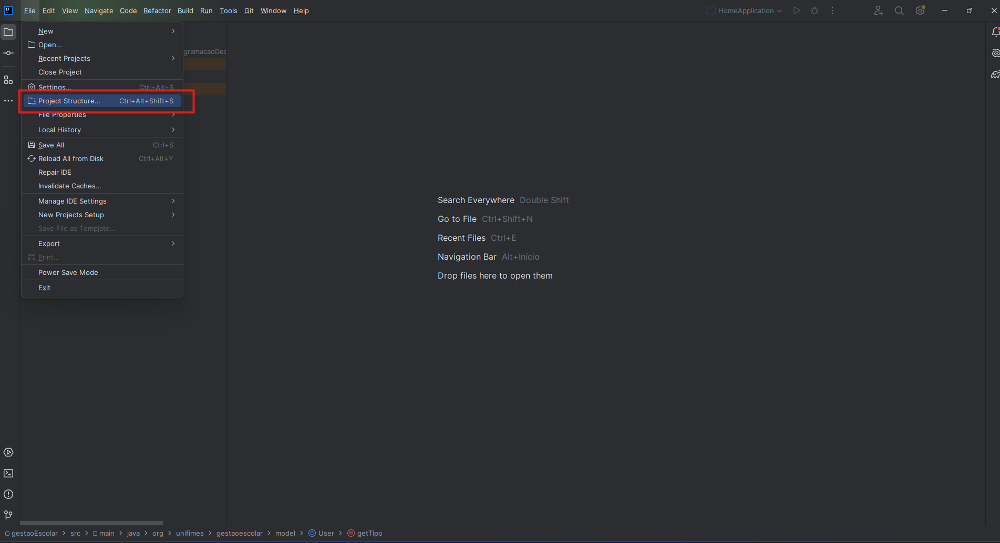
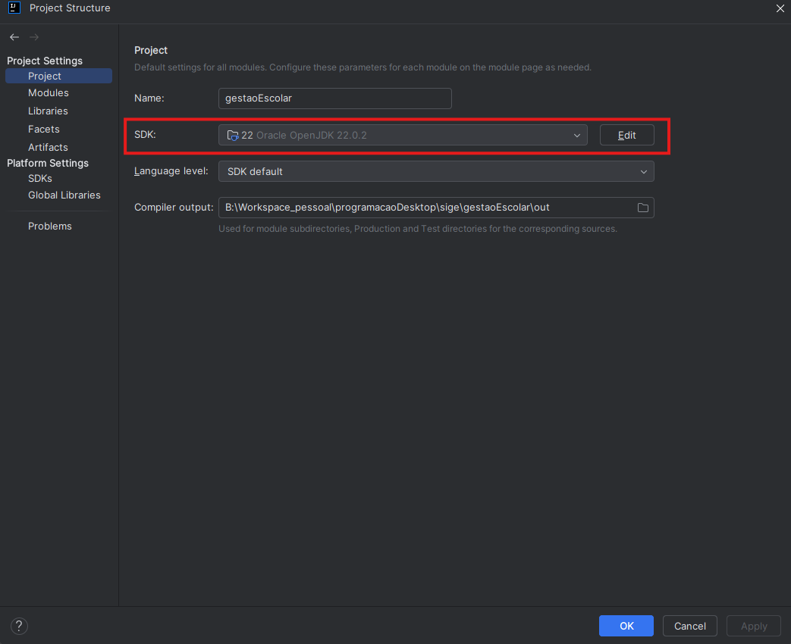
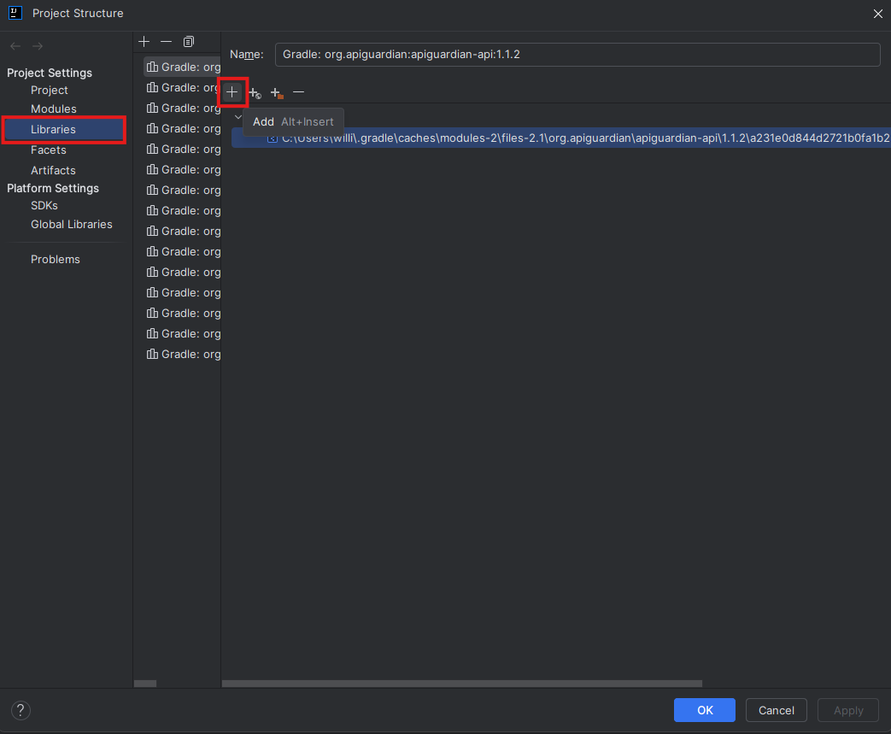
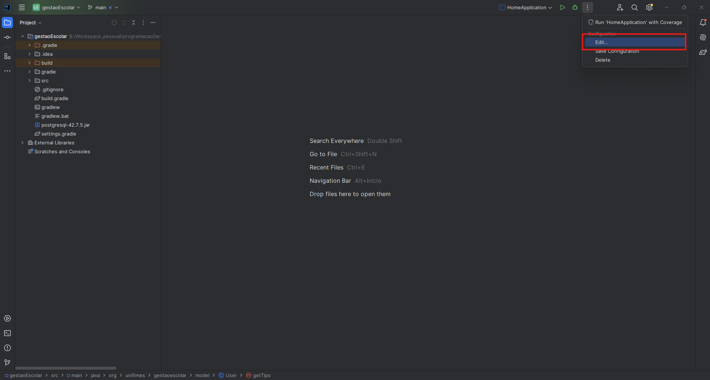
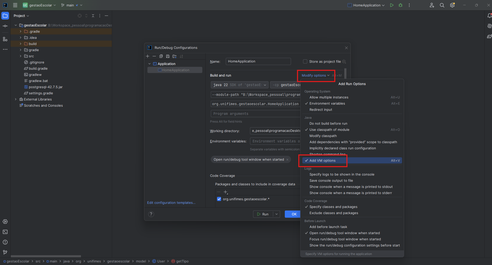
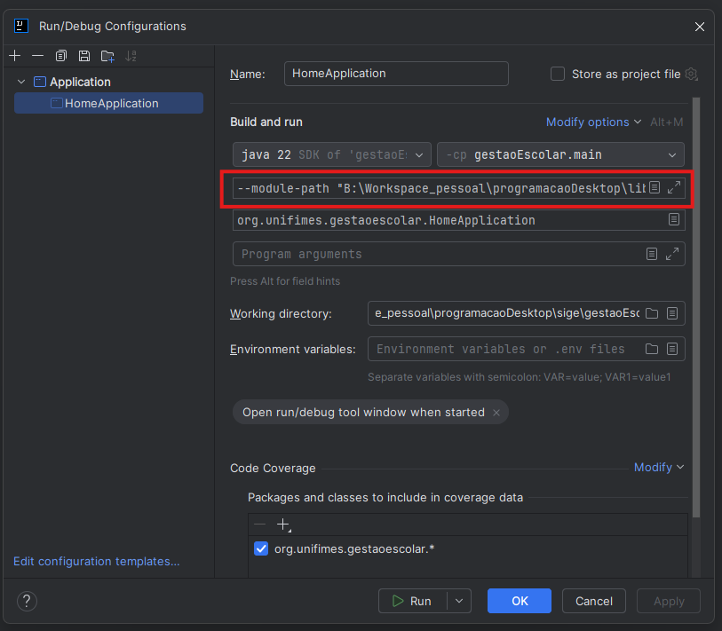
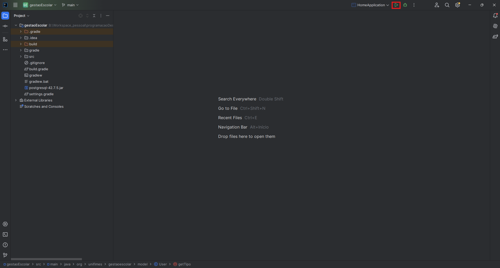

# SIGE
Sige: Sistema de Gestão Escolar

# Requisitos Funcionais:

## Entregas Semana 1 - 29/05 até 30/05

### Módulo 1: Autenticação

- [x] Login com controle de acesso (Admin / Professor).
- [x] Tela de login com persistência (arquivo, SQLite ou outro).

### Módulo 2: Cadastro

- [ ] [tela] Alunos: Nome, matrícula, data de nascimento, turma, status (ativo/inativo).
- [x] Professores: Nome, CPF, disciplinas.
- [ ] Disciplinas: Nome, carga horária.
- [ ] Turmas: Código, nome, turno, ano, disciplinas associadas.

## Entregas Semana 2 - 05/06 e 06/06

### Módulo 3: Lançamento de Notas e Frequência

- [ ]  [tela] Lançamento de notas por turma e disciplina que lescionam.
- [ ]  [tela] Registro de notas por bimestre.
- [ ]  [tela] Registro de faltas.

### Módulo 4: Relatórios

- [ ] [tela dashboad] Boletim individual de aluno(PDF ou visualização).
- [ ] [tela dashboar] Listagem de alunos por turma.
- [ ] [tela dashboard] Frequencia por disciplina.

## Entregas Final - 12/06 e 13/06

# Instalação do Projeto - Windows

## 01 - Baixar e Instalar o JDK (versão recomendada: 22)
[JDK 22.0.2](https://download.oracle.com/java/22/archive/jdk-22.0.2_windows-x64_bin.exe)

## 02 - Baixar IDEA para desenvolvimento

[IntelliJ IDEA Community Edition](https://www.jetbrains.com/pt-br/idea/download/?section=windows).

## 03 - Baixar Scene Builder para desenvolvimento de interfaces
[Scene Builder](https://gluonhq.com/products/scene-builder/#download)

## 04 - Baixar Biblioteca do javafx (versão recomendada:24.0.1)
[JavaFX Libs](https://gluonhq.com/products/javafx/)

## 05 - Abrir o projeto da pasta:gestaoEscolar


## 06 - Acessar a opção **Project Estructure** para definir as bibliotecas do projeto


## 07 - Definir as bibliotecas do JDK
 - Se o JDK já tiver sido identificado pela IDEA desconsiderar esta etapa


## 08 - Definir as bibliotecas javaFx
 - Importar as bibliotecas do javafx da pasta: **openjfx-24.0.1_windows-x64_bin-sdk\javafx-sdk-24.0.1\lib**
 - Importar todas as bibliotecas


## 09 - Acessar configurações de Execução


## 10 - Adicionar opções de VM


## 11 - Adicionar a VM:
  - substituir: **\path\to\javafx-sdk-24.0.1\lib** pelo caminho do seu javafx-sdk
  ```
  --module-path "\path\to\javafx-sdk-24.0.1\lib" --add-modules javafx.controls,javafx.fxml
  ```

  

  ## 12 - Rodar o Projeto
  
  
    


